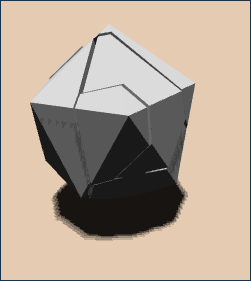

CIS565: Final Project -- GPU-Accelerated Dynamic Real-Time Fracture in the Browser
===========
Fall 2014
-----------
Jiatong He, Kai Ninomiya
-----------

[IMAGE_1]()

Our goal was to create a gpu-accelerated interactive real-time mesh fracture application that runs in the browser.  We used WebCL to parallelize the algorithm and CubicVR to render and simulate the rigid bodies.

[Live demo](https://kainino0x.github.io/cis565final/src/):
requires the [Nokia WebCL plugin](http://webcl.nokiaresearch.com/) for Firefox.

>**Controls**
>
>`click + drag` : Rotate camera view
>
>`alt + click + drag` : Pan camera view
>
>`mouse scroll` : Zoom camera
>
>`click on object + drag` : Move selected object around
>
>`click + drag` : Rotate camera view
>
>`F + click on object` : Fracture object
>
>`W + click` : Toggle wireframe
>
>`D + click` : Toggle fracture pattern

_Based on
[Real Time Dynamic Fracture with Volumetric Approximate Convex Decompositions](https://www.graphics.rwth-aachen.de/media/teaching_files/mueller_siggraph12.pdf)
by Müller, Chentanez, and Kim._

Algorithm Overview
-----------------
###Fracturing
At a high level, fracturing is implemented by performing boolean intersection
between segments of a fracture pattern and the segments of the object to be
fractured.  The fracture pattern can be pre-generated, as is the case for our implementation.

A pre-generated test fracture pattern (series of solid meshes):

^REPLACE WITH NEW IMAGE
####Alignment
The first step is to align the fracture pattern with the point of impact.  We use the point the user clicks on the object as the point of impact, and transform the fracture mesh appropriately (all meshes are centered at 0,0,0).

####Intersection
The mesh must then be intersected with the fracture mesh, resulting in one shard per cell of the fracture pattern.  A simple way to do this is to clip the mesh against each face of the cell, for each cell in the fracture pattern.
[FRACTURE_DIAGRAM]()

####Welding*
If a shard completely fills a cell, then it can be replaced with the cell's geometry.  This reduces the number of triangles produced by the intersection.

####Island Detection*
If a clipping cell results in disconnected pieces within a cell, island detection should be used to split those pieces into multiple shards, instead of just one.  That way you won't have disconnected pieces moving together as though they were one mesh.

###Partial Fracture
Partial fracture occurs if we limit the area of effect of the fracture to some distance around the point of impact.  Rather than allowing the entire mesh to be fractured, we only fully shard the cells within the area of effect.  Shards in cells outside of the area of effect can be merged together back into a single mesh.

_\* : not implemented._

Implementation Details
-------------------
###Fracturing

####Stream Compaction
#####Paralelization

###Working with WebCL
####Performance Issues

###Integration into an Existing Renderer/Rigid Body Simulator (CubicVR)

Performance Analysis
--------------------
###Fracture Performance
####Intersection: GPU vs. CPU, Parallel vs. Sequential

###Stream Compaction
####Parallel vs. Sequential

###WebCL Performance
####Kernel Execution
####Setting Arguments
####Reading/Writing Data from/to Processing Unit

###CubicVR's Limits in Real-Time Simulation

---------------------------------------------------
^^^^^^^^^^^^^^^^^^^^^^^^^^^^^^^^^^^^^^^^^^^^^^^^^^^^^^^^^^^^^^^^^^^^^^^^^^^^^^^^^^^^^^^^^^^^^^^^^^^^^^^^^^^^^^^^

##Paralelization of the Intersection Algorithm
The goal of this algorithm was to find a method to clip meshes that had the least amount of dependence between units.  With this in mind, we came up with the following:

Our code now parallelizes on a per-clipping-face-per-mesh-triangle level.  We run one clipping plane per cell on each triangle in the mesh per loop iteration, iterating through the list of clipping planes per cell.

One key feature is that we no longer handle the mesh as a whole (we still keep track), but as a set of unrelated triangles.  We take this triangle "soup" and run it through the algorithm, getting new triangles with each iteration.  These triangles can be connected by merging identical points at the end of the algorithm if a closed mesh is desired, but disconnected triangles works for our purposes.

The loop runs for max(#cellfaces) iterations.  The kernel processes a triangle-clipping plane pair with a cell number attached to it, and returns a list of triangles and a list of new points.  We take this list and generate a set of new triangles to add to the list, and reiterate.

###Concave Plane Intersections
How to handle?  Centroid connection does not work!

##Stream Compaction
In order to reduce gpu-cpu memory transfer.

##Island Detection
Low priority, necessary both before and after partial fracture.  If implemented, then partial fracture needs to be in its own kernel or loop.

##Partial Fracture
###Algorithm:
* label each cell as "affected" or "not affected"
* after the intersection algorithm runs, combine all "not affected" fracture pieces into a single mesh (for our purposes, put them all into a single cell)
* (optional) perform island detection on that mesh
